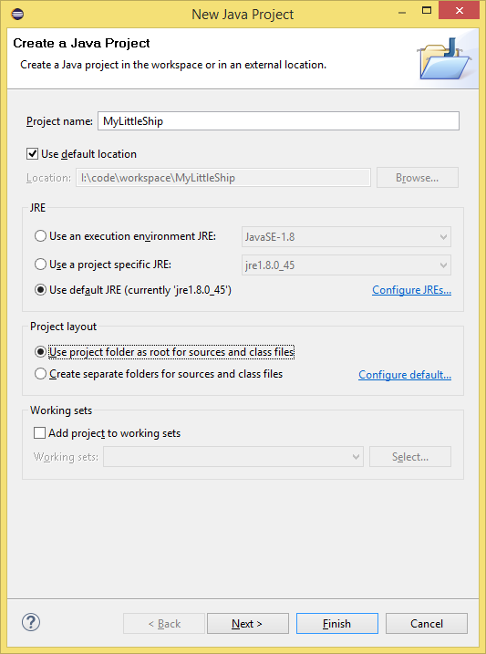
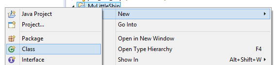
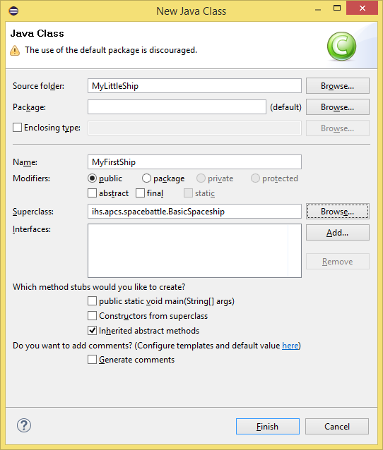
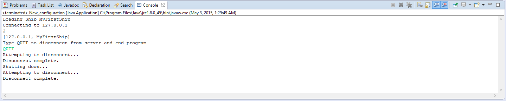

Eclipse Client Environment Setup
=====================

Overview
-----------

This document provides instructions for setting up the Java environment for developing code which controls a ship in the [Space Battle Arena](http://battlearena.mikeware.com/) (SBA) programming game.

These instructions were prepared for [Eclipse](http://www.eclipse.org/) Luna Service Release 2 (4.4.2) and above.

Initial Environment Setup
-----------------------------

1. Create a new **Java Project** in the *Package Exploerer*:

	

2. Make sure to give your Project a name and to select **Use project folder as root for sources and class files**:

	

3. Click **Next**.

4. Click on the **Libraries** tab.	

5. Click on **Add External JARs**.

6. Select both the **[gson-2.2.jar]({{ site.releasepath }}/gson-2.2.jar)** and **[SpaceBattle.jar]({{ site.releasepath }}/SpaceBattle.jar)** which you should have downloaded:

	
	
7. Click **Finish**

Class Setup
----------------------

1. Right-click and add a new **Class** to your new project:

	
	
2. Give you Ship a Name and select the **BasicSpaceship** as the Superclass:

	
	
3. Click **Finish**
	
Fill in some basics to your Spaceship class:

<pre><code>import java.awt.Color;

import ihs.apcs.spacebattle.*;
import ihs.apcs.spacebattle.commands.*;

public class ExampleShip extends BasicSpaceship {
    @Override
    public RegistrationData registerShip(int numImages, int worldWidth, int worldHeight)
    {
        return new RegistrationData("Example Ship", new Color(255, 255, 255), 0);
    }
    
    @Override
    public ShipCommand getNextCommand(BasicEnvironment env)
    {
        return new IdleCommand(0.1);
    }
}
</code></pre>
	
Execution Instructions
-------------------------

**Note: Do not terminate the program through the Eclipse UI; instead, click in the console window and type 'QUIT' to gracefully close the connection.**

1. Open up your **Run Configurations**:

	
	
2. Create a new configuration under Java Application:

	
	
3. Select a **Main class** of *ihs.apcs.spacebattle.TextClient*:

	
	
4. Click the **Arguments** tab and enter the IP address of the server and your *Java Class* name with a space in-between:

	
	
	e.g. 127.0.0.1 MyFirstShip

5. Click **Apply** and **Run**.

6. Type 'QUIT' in the **Console** window to disconnect your ship:

	
