Celestial Objects
==============

There are many different types of objects you may encounter during your travels.  Be sure that your ship knows how to react to them.

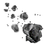{.left}
**Asteroids** float through space at a slow speed.  They may be caught in the gravity of other celestial objects.  They can be destroyed with torpedoes.  Colliding with them will cause damage.

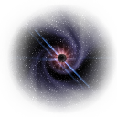{.left}
**Black Holes** are stationary and you cannot collide with them.  They have massive gravity wells which can be hard to escape from with thrusters alone.  Staying too long in the center of a black hole can crush your ship.

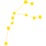{.left}
[Pre-release] **Constellations** are stationary decorations.  They may be useful for research in Discovery Quest though or collecting Energy.

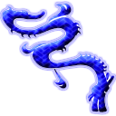{.left}
**Dragons** are hungry for ships.  If you are in their site, they will prey upon you.

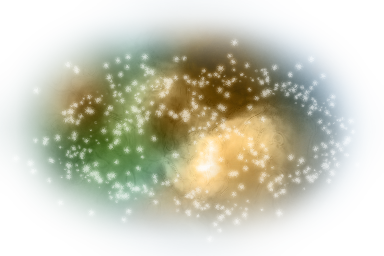{.left}
**Nebulas** are stationary and you cannot collide with them.  They will apply a drag to your ship and slow it down.  You can Lower your Energy Scoop to collect energy from them.  Other ships cannot detect you within a Nebula.

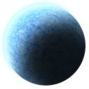{.left}
**Planets** are stationary and have a gravity well.  Colliding with them will cause damage.

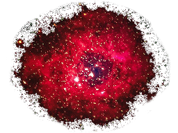{.left}
[Pre-release] **Quasars** are dangerous and prevent Shielding, drain your shields, and slow down energy regeneration on your ship.  In addition to the same properties as Nebulas above; however, they can't be mined for Energy.

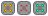{.left}
**Space Mines** are dropped by enemy ships and cause explosions which can damage you and send you off course.  Some may track and follow your ship.

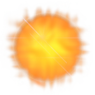{.left}
**Stars** are stationary and you cannot collide with them.  They are hot and will cause more damage to your ship the closer you are to their center.  You can Lower your Energy Scoop to collect energy from them.

{.left}
**Torpedoes** are fired by enemy ships and cause damage when hit.

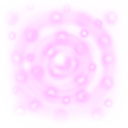{.left}
**Worm Holes** are stationary and can transport your ship across space.  Worm Holes may connect to other worm holes, fixed locations in space, or random locations.

Game Specific
-------------

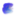{.left}
**Baubles** are trinkets of great value to space traders.  They come in various weights and values.

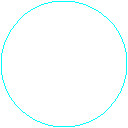{.left}
**Bubbles** are scoring rings.

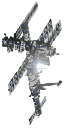{.left}
**Outposts** are used as a central point for you to scout your missions from, they are usually critical to your task at hand.

Other custom games may add their own objects not listed here.