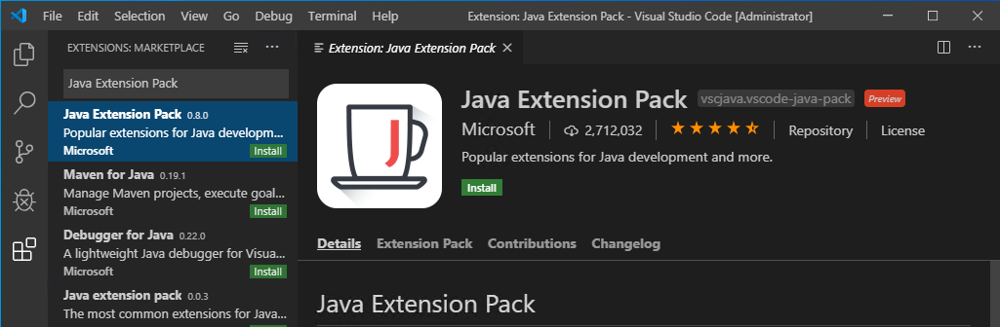
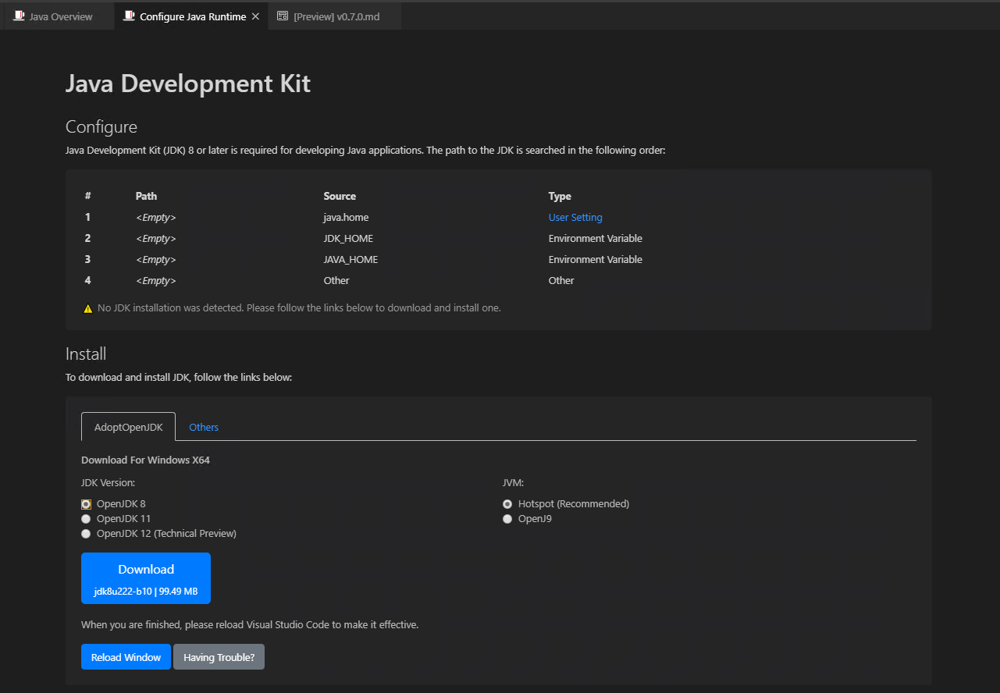
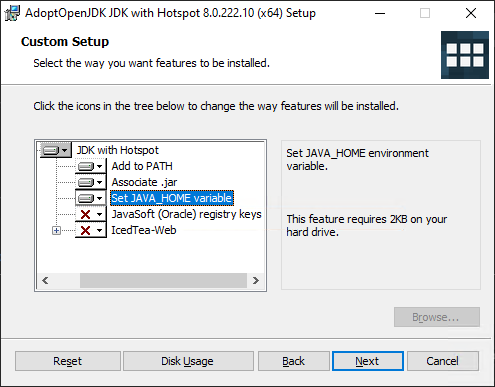
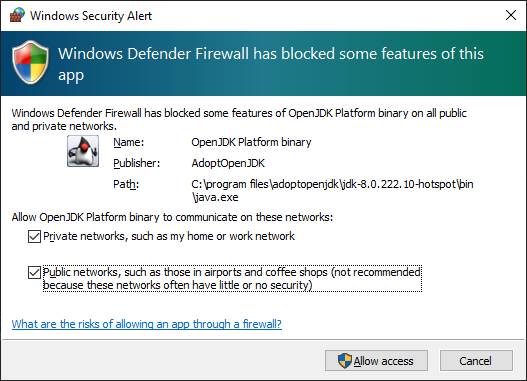
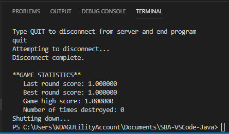

VS Code Client Environment Setup
=====================

<a name="overview"></a>Overview
-----------

This document provides instructions for setting up the Java environment for developing code which controls a ship in the [Space Battle Arena](http://battlearena.mikeware.com/) (SBA) programming game.

These instructions were prepared for [VS Code](http://code.visualstudio.com/) 1.39 and above.

<a name="java"></a>Initial Java Setup
-----------------------------

If you already have Java installed and the **JAVA_HOME** environment variable set, proceed to the next section.

1. Install the **Java Extension Pack** in VS Code: `vscjava.vscode-java-pack`

	

2. It should open the Configure Java Runtime after installed, if not use F1 to get the command: "Java: Configure Java Runtime"

3. See if it has detected your Java installation or not:

	

4. If not, select "OpenJDK 8" and click the "Download" button.

5. VS Code will prompt if you want to open the link, click the "Open Link" button.

6. Download and Run the MSI installer for OpenJDK from your browser.

7. Proceed through the installer to the "Custom Setup" page and change the **JAVA_HOME** option in the dropdown to be installed:

	

8. Click Next after changing the setting and click **Install**.

9. Click the **Reload Window** button in VS Code beneath the Download button you used.

<a name="environment"></a>Initial Environment Setup
-----------------------------

1. Bootstrap the project by using [git](https://git-scm.com/download) to clone our quickstart project:

	```
	git clone https://github.com/Mikeware/SBA-VSCode-Java.git
	```

	This includes all the client library dependencies as well as project and classpath files setup for you.

<a name="classsetup"></a>Class Setup
----------------------

1. Open up the **ExampleShip.java** file under the **src** directory.

2. It should look something like this:	

<pre><code>import java.awt.Color;

import ihs.apcs.spacebattle.*;
import ihs.apcs.spacebattle.commands.*;

public class ExampleShip extends BasicSpaceship {
	
    public static void main(String[] args)
    {
        TextClient.run("127.0.0.1", new ExampleShip());
    }

    @Override
    public RegistrationData registerShip(int numImages, int worldWidth, int worldHeight)
    {
        return new RegistrationData("Example Ship", new Color(255, 255, 255), 0);
    }
    
    @Override
    public ShipCommand getNextCommand(BasicEnvironment env)
    {
        return new IdleCommand(0.1);
    }
}
</code></pre>
	
<a name="execution"></a>Execution Instructions
-------------------------

**Note: Do not terminate the program through the VS Code UI; instead, click in the Terminal window and type 'QUIT' to gracefully close the connection.**

1. In your **ExampleShip.java** file, edit the IP address in the call to TextClient.run to point it to the location of your server.

	```
	TextClient.run("127.0.0.1", new ExampleShip());
	```

2. Hit F5 to launch the ship.

3. You may need to allow the Java client access through the Windows Firewall:

	

	This will be a one-time operation.

4. Type 'QUIT' in the **Terminal** pane to disconnect your ship:

	

	```
	Note: You will NOT see the output of your typing until you hit enter.
	```
