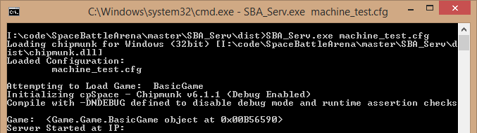

Server Environment Setup
=================

Overview
-----------

As discussed on the [information](index.html) page, the server is a Windows executable.  It can be downloaded in a zip archive from the button in the header on this page.

Installation
-----------------------------

Once downloading the zip archive.  Extract it to its own folder.

This should be the default behavior when right-clicking on the archive file and selecting **Extract All...** and clicking **Extract** in the following dialog box.

Running the Server
-----------------------------

*The server is best run from the command-line in order to pass in the required configuration file parameters.*

However, for an initial test, just double-clicking the executable should bring it up.

Navigate to the directory where the server was extracted.  And open the command prompt.

This can be done from Windows Explorer’s left folder tree pane, by right-clicking on the directory while holding the Shift key on the keyboard.  Then select the **Open Command Window Here** option.

Then type:

	SBA_Serv [configfile]

E.g. 'SBA_Serv machine_test.cfg'

This should spit out some text and then load a new window and start the server:

This window will most likely be all black except for an **IP Address** in white and a message saying there are **0 Players Connected**.

You can follow the [Client Setup](../client/index.html) instructions in order to connect a ship to this server.  Once connected, you should see your ship appear on the screen.

In the [next chapter](config.html), we'll explore the configuration file itself and explain how to change the default behaviors of the server.

**Note:** By default, the server creates a .log file which contains information about what has occurred during the session.  This can be turned off using the additional parameters described in the next section.  Otherwise, you may want to delete it occasionally or before each run.  It is useful to provide this file when requesting any support.

Command-line Parameters (Advanced)
-----------------------------

There are some extra options available for the server as well. It is also possible to pass in any number of configuration files to the server.

Each extra configuration file passed in will override or add to the configuration file before it. Therefore files passed in last (on the right) have the highest precedence.

	Usage: SBA_Serv.exe [options] [config_file] [more_config_files...]

	You should pass at least one config file to the server. Additional config files
	will override/add to the options in the base file.
	
	Options:
	  -h, --help            show this help message and exit
	  -n, --nolog           turns logging off
	  -v, --verbose         turns logging to DEBUG (from INFO)
	  -l LOGFILENAME, --logfile=LOGFILENAME
	                        specifies the file to log info to
